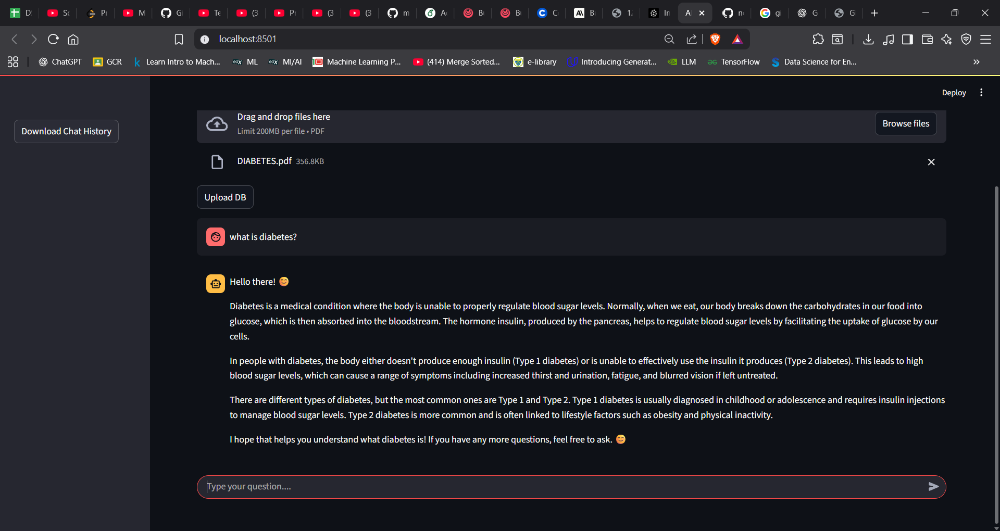

# AI Medical Assistant

This project is an AI-powered medical assistant that can answer questions based on medical documents. It uses a combination of a FastAPI backend and a Streamlit frontend.

## Features

- **Upload Medical Documents:** Users can upload PDF documents containing medical information.
- **Ask Questions:** Users can ask questions related to the uploaded documents and get answers from an AI model.
- **Chat History:** The chat history is maintained and can be downloaded.
- **Vectorstore Integration:** The backend uses Pinecone as a vectorstore to efficiently store and retrieve information from the documents.
- **Powered by LangChain and Google Generative AI:** The core question-answering logic is built using LangChain and Google's state-of-the-art generative AI models.

## Project Structure

The project is divided into two main components:

- **`backend`:** A FastAPI application that handles document processing, vectorstore management, and question-answering.
- **`frontend`:** A Streamlit application that provides a user-friendly interface for interacting with the medical assistant.

## Walkthrough: How to Run the Project

### Prerequisites

- Python 3.10 or higher
- `pip` for installing packages

### 1. Set up the Backend

1.  **Navigate to the `backend` directory:**
    ```bash
    cd backend
    ```

2.  **Install the required dependencies:**
    ```bash
    pip install -r requirements.txt
    ```

3.  **Set up your environment variables:**
    Create a `.env` file in the `backend` directory and add the following variables:
    ```
    GOOGLE_API_KEY="YOUR_GOOGLE_API_KEY"
    PINECONE_API_KEY="YOUR_PINECONE_API_KEY"
    PINECONE_ENVIRONMENT="YOUR_PINECONE_ENVIRONMENT"
    PINECONE_INDEX_NAME="YOUR_PINECONE_INDEX_NAME"
    ```

4.  **Run the backend server:**
    ```bash
    uvicorn main:app --reload
    ```
    The backend server will be running at `http://127.0.0.1:8000`.

### 2. Set up the Frontend

1.  **Navigate to the `frontend` directory:**
    ```bash
    cd frontend
    ```

2.  **Install the required dependencies:**
    ```bash
    pip install -r requirements.txt
    ```

3.  **Run the frontend application:**
    ```bash
    streamlit run app.py
    ```
    The frontend application will be running at `http://localhost:8501`.

## Screenshots

### Chat Interface


